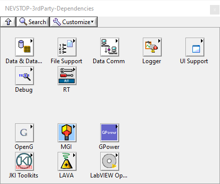

# NEVSTOP-3rdParty-Dependencies

This library is used for one-click installation of the most commonly used LabVIEW libraries in VIPM, which are heavily used by NEVSTOP-Lab. Please note that the copyright of these libraries belongs to their respective owners. Enjoy!

## **COPYRIGHT STATEMENT**

>
> **All Referred Libraries belongs to its own owner, Please notice and follow their LICENSE.**
>

## OpenG Toolkit

> The OpenG Toolkit package installs the OpenG Libraries 4.0: Application Control, Array, Boolean, Buttons Comparison, Dictionary, Error, File, LabVIEW Data, LabVIEW ZIP, Large File, MD5, Message Queue, Numeric, Picture, Port IO, String, Time and Variant Configuration File.

- OpenG Toolkit >= 4.0.1.9
- OpenG Variant Data Library >= 5.0.0.27
- OpenG String Library >= 5.0.0.25

## MGI Library

> The MGI Library is a collection of the VIs used most heavily by Moore Good Ideas employees. The Library is free to use and distribute, and is provided as a public service to the LabVIEW Community by Moore Good Ideas. Enjoy!

- MGI Library >= 1.2.0.4

## JKI

- JKI State Machine >= 2018.0.7.45
- EasyXML Toolkit for LabVIEW  >= v3.0.0.170
- JKI JSON >= v1.1.10.37

## GPower

> The GPower Toolkit is free software that provides reuse libraries for the LabVIEW programming environment. Download GPower Toolkit and find support information. You can use this download page to access GPower Toolkit and all available editions are available from this download page.

  This Package depends on these other packages:
-  GPower Array >= 2016.2.0.27
-  GPower Comparison >= 2016.0.0.4
-  GPower Error & Warning >= 2014.0.0.38
-  GPower Events >= 2012.0.0.7
-  GPower Math >= 2012.1.0.6
-  GPower Numeric >= 2016.2.0.14
-  GPower Overflow >= 2014.0.0.4
-  GPower String >= 2016.1.0.11
-  GPower Timing >= 2017.0.0.26
-  GPower VI Launcher >= 2012.2.0.26
-  GPower VI Register >= 2016.0.0.31

## National Instruments

- NI Simple Messaging (STM) Library >= 3.1.0.9
- NI Asynchronous Message Communication (AMC) Library >= 3.3.1.22
- NI CVT Client Communication (CCC) >= 3.0.3.9
- NI Current Value Table >= 3.3.0.13
- NI Event Logger Library >= 1.0.0.9
- NI Software Watchdog >= 1.0.0.24
- NI String Tools Library >= 2.0.0.5
- NI Syslog Library >= 1.3.3.27
- NI Linux RT Errno >= 1.1.2.9
- NI Linux RT Inter-Process Communication >= 1.5.1.19
- NI Linux RT Utilities >= 1.1.1.9
- NI RT Management >= 1.1.1.41

## LabVIEW Open Source Project

 - Data Manipulation v1.6.0.16 by LabVIEW Open Source Project
 - OpenSerializer >= v1.2.1.16
 - OpenSerializer.Base64 >= v1.0.2.4
 - OpenSerializer easyXML >= v1.0.0.1
 - OpenSerializer JKI JSON >= v1.0.0.1
 - Epoch Date & Time >= 1.2.0.6
